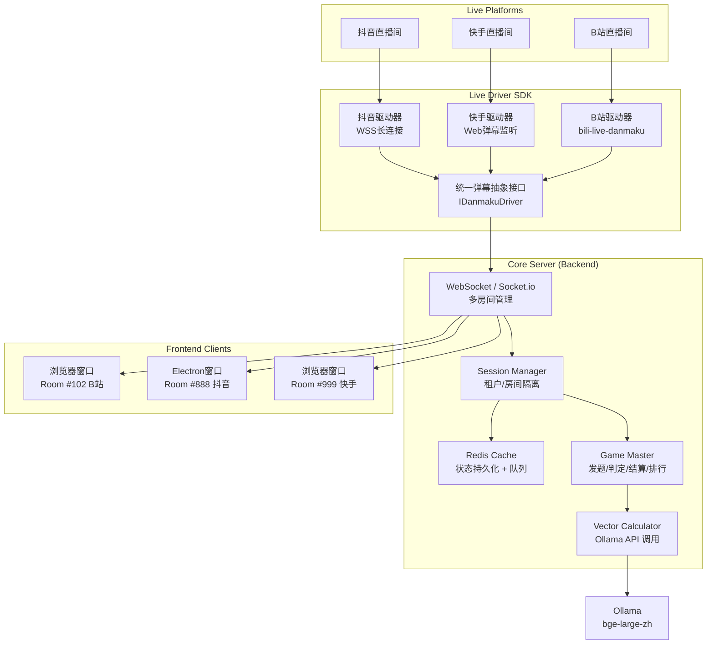

<p align="center">
  
</p>

<h1 align="center">WordToFlush 🎮</h1>

<p align="center">
  <b>AI 驱动的多端弹幕猜词互动游戏系统</b><br/>
  <sub>抖音 · 快手 · B站 三端通吃 | 本地大模型算力 | 零 API 成本</sub>
</p>

<p align="center">
  <a href="#"></a>
  <a href="#"></a>
  <a href="#"></a>
  <a href="#"></a>
  <a href="#"></a>
  <a href="#"></a>
</p>

<p align="center">
  <a href="#-快速开始">🚀 快速开始</a> · 
  <a href="#-架构设计">🏗️ 架构</a> · 
  <a href="#-游戏机制">🎮 玩法</a> · 
  <a href="#-技术栈">🛠 技术栈</a> · 
  <a href="#-多开指南">📺 多开</a>
</p>

---

## ✨ 为什么选 WordToFlush？

| 痛点 | 传统方案 | **WordToFlush** |
|:---|:---|:---|
| 💰 API 成本 | 调用 OpenAI / 文心一言，按量计费 | **本地 Ollama 运行，零外部调用成本** |
| 🔌 平台锁定 | 只支持单一平台弹幕 | **抖音 + 快手 + B站 统一抽象层，一键切换** |
| 🖥️ 推流限制 | 单进程单窗口，无法多直播间并行 | **强后端基座 + 轻前端渲染，后端驱动多开** |
| 🧠 语义精度 | 字符串匹配 / 规则引擎，误判率高 | **bge-large-zh 词向量余弦相似度，语义级关联** |
| ⚡ 实时反馈 | 轮询或延迟高 | **WebSocket 全双工，弹幕捕获 → 计算 → 反馈 < 200ms** |

> **一句话总结**：用一台带 GPU 的电脑，零 API 成本，同时开 3 个直播间，让观众弹幕猜词，AI 实时算关联度，自动排行积分。

---

## 🎮 游戏机制与交互

### 核心玩法

1. **发题**：系统从题库（学习用品 / 美食 / 数码 / 成语等）随机抽取 **3 字或 4 字谜底**
2. **猜词**：观众在直播间公屏发送弹幕（如谜底是"笔记本"，观众猜"数码产品"、"钢笔"）
3. **AI 判定**：系统通过 Ollama 本地模型计算猜测词与谜底的 **语义关联度（0% - 100%）**
4. **加星进阶**：首个猜对或关联度达阈值的玩家为直播间"加星"，解锁进阶提示
5. **实时排行**：积分榜、热度榜、上期回顾自动刷新

### 界面布局（9:16 直播推流适配）

```
┌─────────────────────────────────────┐
│  [赛季 S1]  [★★★☆☆]  [提示|进阶|跳过] │  ← 顶部信息区
├─────────────────────────────────────┤
│                                     │
│    分类：学习用品                     │  ← 核心解密区
│    ?  ?  ?  （3字谜底）               │
│    当前最高关联度：87%                │
│                                     │
├──────────┬────────────┬─────────────┤
│ 竞猜榜    │            │  总积分榜   │
│ 用户A 92% │   动态     │  1. 用户X   │
│ 用户B 78% │   特效     │  2. 用户Y   │
│ 用户C 65% │   区域     │  3. 用户Z   │
│  ...     │            │  上期：笔记本│
└──────────┴────────────┴─────────────┘
         ↑ 左侧滚动榜    ↑ 右侧实时榜
```

---

## 🏗️ 架构设计

### 系统架构图



### 核心数据流

```
弹幕输入 → 平台适配层 → 统一消息队列 → SessionManager(房间隔离) 
    → GameMaster(业务逻辑) → VectorCalculator(Ollama嵌入) 
    → 关联度计算 → WebSocket广播 → 前端渲染 → OBS推流
```

---

## 🛠 技术栈

### 后端基座 (Core Server)

| 组件 | 技术选型 | 职责 |
|:---|:---|:---|
| 核心框架 | **Node.js + TypeScript** / Go (Gin) | HTTP + WebSocket 服务 |
| 会话管理 | **Socket.io** / ws | 多房间实时同步与状态广播 |
| 向量计算 | **Ollama API** (`bge-large-zh` / `all-minilm`) | 本地语义嵌入与余弦相似度 |
| 数据缓存 | **Redis** | 多开会话状态持久化、弹幕队列削峰 |
| 配置管理 | dotenv + Joi | 环境变量与参数校验 |

### 前端渲染 (Frontend Client)

| 组件 | 技术选型 | 职责 |
|:---|:---|:---|
| 构建工具 | **Vite** | 极速 HMR 与打包 |
| UI 框架 | **Vue 3** (Composition API) / React | 响应式组件与状态管理 |
| 样式方案 | **TailwindCSS** | 原子化 CSS，快速适配 9:16 布局 |
| 运行环境 | **浏览器** / **Electron** | 浏览器直接打开，或 Electron 多开配合 OBS |
| 动画效果 | GSAP / Framer Motion | 竞猜榜滚动、星级特效、关联度进度条 |

### 接入层驱动 (Live Driver SDK)

| 平台 | 接入方案 | 状态 |
|:---|:---|:---|
| **Bilibili** | [bili-live-danmaku](https://github.com/Discreater/bili-live-danmaku) 或官方开放平台 SDK | ✅ 优先推荐 |
| **抖音** | 基于 WSS 协议解析的开源长连接库 / 官方互动大屏开发包 | 🔄 开发中 |
| **快手** | Web 端长连接转换的弹幕监听层 | 🔄 开发中 |

---

## 🚀 快速开始

### 前置要求

- Node.js ≥ 18
- Redis 6.0+（本地或 Docker）
- [Ollama](https://ollama.com/) 已安装并运行
- （可选）GPU 加速以获得更佳嵌入模型性能

### 1. 启动 Ollama 并下载嵌入模型

```bash
# 启动 Ollama 服务
ollama serve

# 拉取中文语义嵌入模型（推荐，维度 1024）
ollama pull bge-large-zh

# 或轻量版（维度 384，CPU 友好）
ollama pull all-minilm
```

### 2. 配置并启动后端

```bash
# 克隆项目
git clone https://github.com/yourname/wordtoflush.git
cd wordtoflush/server

# 环境配置
cp .env.example .env
# 编辑 .env，填入你的平台凭证（如使用官方 API）

# 安装依赖
npm install

# 启动开发服务
npm run dev
```

**`.env` 配置示例：**

```env
PORT=8080
OLLAMA_HOST=http://localhost:11434
OLLAMA_MODEL=bge-large-zh
REDIS_URL=redis://localhost:6379

# 各平台凭证（可选，仅官方 API 需要）
DY_APP_ID=your_douyin_app_id
KS_APP_KEY=your_kuaishou_key
BILI_PROJECT_ID=your_bilibili_project_id
```

### 3. 启动前端（支持多开）

```bash
cd ../client
npm install
npm run dev
```

**多开进程示例：**

| 进程 | URL | 用途 |
|:---|:---|:---|
| 窗口 1 | `http://localhost:3000/?platform=bilibili&roomId=102` | B站直播间 #102 |
| 窗口 2 | `http://localhost:3000/?platform=douyin&roomId=888` | 抖音直播间 #888 |
| 窗口 3 | `http://localhost:3000/?platform=kuaishou&roomId=666` | 快手直播间 #666 |

> 💡 **Electron 多开**：运行 `npm run electron:multi` 自动启动 3 个独立渲染进程，每个进程对应一个直播间，可直接被 OBS 窗口捕获。

---

## 🧠 核心逻辑：向量关联度计算

```typescript
import axios from 'axios';

/**
 * 获取文本的向量嵌入
 */
async function getEmbedding(text: string): Promise<number[]> {
    const response = await axios.post('http://localhost:11434/api/embeddings', {
        model: 'bge-large-zh',
        prompt: text
    });
    return response.data.embedding;
}

/**
 * 计算余弦相似度
 */
function cosineSimilarity(vecA: number[], vecB: number[]): number {
    const dotProduct = vecA.reduce((sum, a, i) => sum + a * vecB[i], 0);
    const normA = Math.sqrt(vecA.reduce((sum, a) => sum + a * a, 0));
    const normB = Math.sqrt(vecB.reduce((sum, b) => sum + b * b, 0));
    return dotProduct / (normA * normB);
}

/**
 * 计算猜测词与谜底的关联度（0.0 - 1.0）
 */
export async function calculateAffinity(guess: string, target: string): Promise<number> {
    // 完全匹配直接返回 100%
    if (guess === target) return 1.0;

    const vecA = await getEmbedding(guess);
    const vecB = await getEmbedding(target);
    const sim = cosineSimilarity(vecA, vecB);

    // 平滑映射到 0% - 100% 展示区间
    return Math.max(0, Math.min(1, sim));
}
```

### 性能优化策略

- **嵌入缓存**：Redis 缓存已计算词汇的向量，避免重复调用 Ollama
- **批量嵌入**：支持批量请求减少 HTTP 往返
- **异步队列**：弹幕猜测进入 Redis 队列，Worker 消费计算，避免阻塞

---

## 📁 项目结构

```
wordtoflush/
├── 📂 server/                    # 后端基座
│   ├── src/
│   │   ├── core/
│   │   │   ├── GameMaster.ts     # 游戏主控：发题/判定/结算
│   │   │   ├── SessionManager.ts # 多房间会话隔离
│   │   │   └── VectorCalculator.ts # Ollama 向量计算
│   │   ├── drivers/
│   │   │   ├── IDanmakuDriver.ts # 统一弹幕接口抽象
│   │   │   ├── BilibiliDriver.ts
│   │   │   ├── DouyinDriver.ts
│   │   │   └── KuaishouDriver.ts
│   │   ├── websocket/
│   │   │   └── SocketHandler.ts  # 房间状态广播
│   │   └── index.ts              # 服务入口
│   ├── .env.example
│   └── package.json
│
├── 📂 client/                    # 前端渲染
│   ├── src/
│   │   ├── components/
│   │   │   ├── TopBar.vue        # 顶部信息区
│   │   │   ├── DecryptZone.vue   # 核心解密区
│   │   │   ├── GuessList.vue     # 左侧竞猜榜
│   │   │   └── Leaderboard.vue   # 右侧实时排行
│   │   ├── stores/
│   │   │   └── gameStore.ts      # Pinia 游戏状态
│   │   └── App.vue
│   ├── electron/
│   │   └── main.js               # Electron 多开入口
│   └── package.json
│
├── 📂 shared/                    # 共享类型与常量
│   └── types/
│       └── game.ts
│
├── docker-compose.yml            # 一键部署：Redis + Server
└── README.md
```

---

## 📺 多开与 OBS 推流指南

### 场景：同时运营 3 个直播间

```bash
# 启动后端（单实例驱动多房间）
cd server && npm run dev

# 终端 1：B站直播间窗口
cd client && npm run electron -- --platform=bilibili --roomId=102

# 终端 2：抖音直播间窗口
cd client && npm run electron -- --platform=douyin --roomId=888

# 终端 3：快手直播间窗口
cd client && npm run electron -- --platform=kuaishou --roomId=666
```

### OBS 窗口捕获设置

1. 每个 Electron 窗口设置固定标题（如 `WordToFlush-B站-102`）
2. OBS 添加「窗口捕获」源，选择对应标题
3. 调整画布为 **1080×1920（9:16）** 竖屏比例
4. 添加直播间推流码，开始直播

---

## 🛡️ 免责声明

> ⚠️ **本项目开源仅供学习和技术研究目的**，演示弹幕长连接协议解析与本地大模型交互的实践。
>
> 使用本系统时，请**严格遵守各直播平台的用户服务协议与开发者规范**。通过非官方授权 SDK 接入平台造成的账号封禁、内容下架或其他合规风险，**由使用者自行承担**。
>
> 请勿将本系统用于：
> - 违反平台社区准则的自动化互动
> - 恶意刷量或干扰正常直播秩序
> - 任何侵犯用户隐私或数据安全的行为

---

<p align="center">
  <sub>Built with ❤️ by the open-source community. Powered by Ollama.</sub>
</p>
