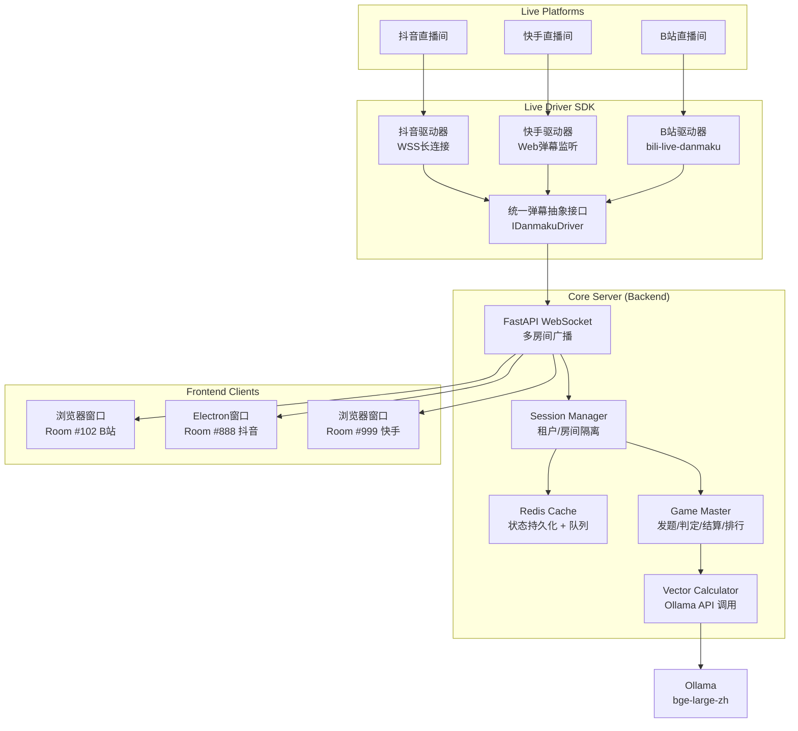

<p align="center">
  
</p>

<h1 align="center">WordToFlush 🎮</h1>

<p align="center">
  <b>AI 驱动的多端弹幕猜词互动游戏系统</b><br/>
  <sub>抖音 · 快手 · B站 三端通吃 | 本地大模型算力 | 零 API 成本</sub>
</p>

<p align="center">
   <a href="#"></a>
   <a href="#"></a>
  <a href="#"></a>
   <a href="#"></a>
  <a href="#"></a>
  <a href="#"></a>
  <a href="#"></a>
</p>

<p align="center">
  <a href="#-快速开始">🚀 快速开始</a> · 
  <a href="#-架构设计">🏗️ 架构</a> · 
  <a href="#-游戏机制">🎮 玩法</a> · 
  <a href="#-技术栈">🛠 技术栈</a> · 
  <a href="#-多开指南">📺 多开</a>
</p>

---

## ✨ 为什么选 WordToFlush？

| 痛点 | 传统方案 | **WordToFlush** |
|:---|:---|:---|
| 💰 API 成本 | 调用 OpenAI / 文心一言，按量计费 | **本地 Ollama 运行，零外部调用成本** |
| 🔌 平台锁定 | 只支持单一平台弹幕 | **抖音 + 快手 + B站 统一抽象层，一键切换** |
| 🖥️ 推流限制 | 单进程单窗口，无法多直播间并行 | **强后端基座 + 轻前端渲染，后端驱动多开** |
| 🧠 语义精度 | 字符串匹配 / 规则引擎，误判率高 | **bge-large-zh 词向量余弦相似度，语义级关联** |
| ⚡ 实时反馈 | 轮询或延迟高 | **WebSocket 全双工，弹幕捕获 → 计算 → 反馈 < 200ms** |

> **一句话总结**：用一台带 GPU 的电脑，零 API 成本，同时开 3 个直播间，让观众弹幕猜词，AI 实时算关联度，自动排行积分。

---

## 🎮 游戏机制与交互

### 核心玩法

1. **发题**：系统从题库（天体 / 地理地貌 / 气象活动 / 季节 / 动物 / 植物 / 职业 / 品质 / 交通工具 / 娱乐活动 / 运动项目 / 美食 / 数码产品 / 学习用品等）随机抽取 **1 至 4 字谜底**
2. **猜词**：观众在直播间公屏发送弹幕（如谜底是"笔记本"，观众猜"文具"、"钢笔"）。猜测词必须与谜底字数一致才被接受，否则整条废弃。
3. **字位揭示**：猜测词中与谜底某字位字符完全相同的位置，其红色 `?` 将变为绿色的实际汉字（如谜底"自行车"，猜测"小汽车"则末位"车"被揭示为绿色）
4. **AI 判定**：系统通过 Ollama 本地模型计算猜测词与谜底的 **语义关联度（0% - 100%）**
5. **猜中即止**：当某用户猜测词与谜底的向量相似度 >= 阈值时判定猜中，立即停止竞猜，显示正确答案 3 秒并展示猜中用户，自动进入下一轮
6. **实时排行**：积分榜、热度榜、上期回顾自动刷新
7. **竞猜榜去重**：相同词汇合并显示（多人发送显示 "x N"），按准确率前 10 排行
8. **180 秒超时**：每题限时 180 秒，倒计时实时显示；超时自动跳过进入下一题；临近超时（最后 18 秒）倒计时转为红色提醒

### 界面布局（9:16 直播推流适配）

```
┌─────────────────────────────────────┐
│  [赛季 S1]               [换题]       │  ← 顶部信息区
├─────────────────────────────────────┤
│                                     │
│    分类：学习用品                     │  ← 核心解密区
│    ?  ?  ?  （3字谜底，匹配字位变绿）    │
│    当前最高关联度：87%                │
│    倒计时：02:37                     │  ← 180秒倒计时（末18秒变红）
│                                     │
├──────────┬────────────┬─────────────┤
│ 竞猜榜    │            │  总积分榜   │
│ 用户A 92% │   动态     │  1. 用户X   │
│ 用户B 78% │   特效     │  2. 用户Y   │
│ 用户C 65% │   区域     │  3. 用户Z   │
│  ...     │            │  上期：笔记本│
└──────────┴────────────┴─────────────┘
         ↑ 左侧滚动榜    ↑ 右侧实时榜
```

---

## 🏗️ 架构设计

### 系统架构图



### 核心数据流

```
弹幕输入 → 平台适配层 → 统一消息队列 → SessionManager(房间隔离) 
    → GameMaster(业务逻辑) → VectorCalculator(Ollama嵌入) 
    → 关联度计算 → 猜中判定 (相似度 >= WIN_AFFINITY_THRESHOLD)
    → 猜中立即停止 → 3s 揭示答案 → 自动下一题
    → 180 秒未猜中 → 前端倒计时归零自动换题
    → WebSocket广播 (game:puzzleSolved / game:state) → 前端渲染 → OBS推流
```

---

## 🛠 技术栈

### 后端基座 (Core Server)

| 组件 | 技术选型 | 职责 |
|:---|:---|:---|
| 核心框架 | **Python FastAPI** + Swagger | HTTP REST API + WebSocket 服务 |
| 会话管理 | **FastAPI WebSocket** (原生) | 多房间实时同步与状态广播 |
| 向量计算 | **Ollama API** (`bge-large-zh` / `all-minilm`) | 本地语义嵌入与余弦相似度 |
| 数据缓存 | **Redis** | 多开会话状态持久化、弹幕队列削峰 |
| 部署方式 | **Docker Compose** (唯一部署方式) | 一键编排 Redis + Backend |
| 配置管理 | python-dotenv | 环境变量与参数校验 |

### 前端渲染 (Frontend Client)

| 组件 | 技术选型 | 职责 |
|:---|:---|:---|
| 构建工具 | **Vite** | 极速 HMR 与打包 |
| UI 框架 | **Vue 3** (Composition API) / React | 响应式组件与状态管理 |
| 样式方案 | **TailwindCSS** | 原子化 CSS，快速适配 9:16 布局 |
| 运行环境 | **浏览器** / **Electron** | 浏览器直接打开，或 Electron 多开配合 OBS |
| 动画效果 | GSAP / Framer Motion | 竞猜榜滚动、星级特效、关联度进度条 |

### 接入层驱动 (Live Driver SDK)

| 平台 | 接入方案 | 状态 |
|:---|:---|:---|
| **Bilibili** | [bili-live-danmaku](https://github.com/Discreater/bili-live-danmaku) 或官方开放平台 SDK | ✅ 优先推荐 |
| **抖音** | 基于 WSS 协议解析的开源长连接库 / 官方互动大屏开发包 | 🔄 开发中 |
| **快手** | Web 端长连接转换的弹幕监听层 | 🔄 开发中 |

---

## 🚀 快速开始

### 前置要求

- Python 3.12+ / Docker & Docker Compose
- Node.js ≥ 18（仅前端开发需要）
- [Ollama](https://ollama.com/) 已安装并运行（宿主机）
- （可选）GPU 加速以获得更佳嵌入模型性能

### 1. 启动 Ollama 并下载嵌入模型

```bash
# 启动 Ollama 服务（Linux 下使用 Docker 部署时，必须监听 0.0.0.0）
OLLAMA_HOST=0.0.0.0:11434 ollama serve

# 拉取中文语义嵌入模型（推荐，维度 1024）
ollama pull bge-large-zh

# 或轻量版（维度 384，CPU 友好）
ollama pull all-minilm
```

> **Linux 部署注意**：Ollama 默认只监听 `127.0.0.1`，Docker 容器无法访问。启动时需设置环境变量 `OLLAMA_HOST=0.0.0.0:11434`，或配置 systemd 覆盖文件。

### 2. 配置并启动后端（Docker Compose，唯一部署方式）

```bash
cd backend

# 环境配置
cp .env.example .env
# 编辑 .env，可按需修改宿主机端口、Ollama 地址等

# 启动全部服务（Redis + Backend）
docker compose up -d --build
```

**`backend/.env` 配置示例：**

```env
# Docker Compose 项目名
COMPOSE_PROJECT_NAME=word-to-flush-backend

# 宿主机映射端口（容器内始终监听 8000）
HOST_BIND_PORT=8000

# Admin 控制面板配置
ADMIN_HOST_BIND_PORT=8001
ADMIN_USERNAME=admin
ADMIN_PASSWORD=your-secure-password
FLASK_SECRET_KEY=

# Ollama API 地址（docker 内使用 host.docker.internal）
OLLAMA_HOST=http://host.docker.internal:11434
OLLAMA_MODEL=bge-large-zh

# Redis 连接地址
REDIS_URL=redis://redis:6379

# 平台凭证（可选）
DY_APP_ID=
KS_APP_KEY=
BILI_PROJECT_ID=
```

> API 文档 (Swagger UI) 启动后访问 `http://localhost:8000/docs`
>
> Admin 控制面板启动后访问 `http://localhost:<ADMIN_HOST_BIND_PORT>` (默认 8001)

### 3. 启动前端（支持多开）

```bash
cd frontend

# 环境配置
cp .env.example .env
# 编辑 .env，可配置开发端口与后端地址

npm install
npm run dev
```

**多开进程示例：**

所有打开的页面共享同一个全局游戏会话。直接用浏览器打开即可:

| 进程 | URL | 用途 |
|:---|:---|:---|
| 窗口 1 | `http://localhost:3000/` | 游戏画面 #1 |
| 窗口 2 | `http://localhost:3000/` | 游戏画面 #2 |
| 窗口 3 | `http://localhost:3000/` | 游戏画面 #3 |

> 💡 **Electron 多开**：运行 `npm run electron:multi` 自动启动 3 个独立渲染进程，可直接被 OBS 窗口捕获。所有窗口共享同一全局游戏状态。

---

## 🧠 核心逻辑：向量关联度计算

```python
import httpx, math

async def get_embedding(text: str) -> list[float]:
    resp = await httpx.AsyncClient().post(
        "http://localhost:11434/api/embeddings",
        json={"model": "bge-large-zh", "prompt": text}
    )
    return resp.json()["embedding"]

def cosine_similarity(vec_a, vec_b):
    dot = sum(a * b for a, b in zip(vec_a, vec_b))
    return dot / (math.sqrt(sum(a**2 for a in vec_a)) * math.sqrt(sum(b**2 for b in vec_b)))

async def calculate_affinity(guess: str, target: str) -> float:
    if guess == target:
        return 1.0
    a, b = await get_embedding(guess), await get_embedding(target)
    return max(0.0, min(1.0, cosine_similarity(a, b)))
```

### 性能优化策略

- **嵌入缓存**：Redis 缓存已计算词汇的向量，避免重复调用 Ollama
- **批量嵌入**：支持批量请求减少 HTTP 往返
- **异步队列**：弹幕猜测进入 Redis 队列，Worker 消费计算，避免阻塞

---

## 📁 项目结构

```text
wordtoflush/
├── backend/                         # 后端基座 (Python FastAPI)
│   ├── app/
│   │   ├── core/
│   │   │   ├── game_master.py       # 游戏主控：发题/判定/结算
│   │   │   ├── session_manager.py   # 多房间会话隔离
│   │   │   ├── vector_calculator.py # Ollama 向量计算
│   │   │   └── danmaku_filter.py    # 弹幕清洗与校验
│   │   ├── models/
│   │   │   └── game.py              # Pydantic 数据模型
│   │   ├── websocket/
│   │   │   └── connection_manager.py # WebSocket 房间广播
│   │   ├── data/
│   │   │   ├── word_data/           # 词库数据（每分类一个JSON，文件名即分类名）
│   │   │   └── word_puzzle_repository.py # 题库加载器（动态扫描JSON）
│   │   └── main.py                  # FastAPI 服务入口 + Swagger
│   ├── admin/                        # Admin 控制面板 (Flask)
│   │   ├── app.py                    # Flask 应用 + SSE + 自动猜词桥
│   │   ├── config.py                 # Admin 环境变量读取
│   │   ├── auth.py                   # 会话登录认证
│   │   ├── run_admin.py             # 多进程启动入口
│   │   ├── danmaku/                  # 弹幕采集模块
│   │   │   ├── douyin.py            # 抖音 WSS 弹幕采集
│   │   │   ├── bilibili.py          # B站 弹幕采集
│   │   │   ├── proto_reader.py      # 抖音 Protobuf 解析
│   │   │   └── manager.py           # 采集器管理
│   │   ├── dy/                       # 抖音采集参考项目 (TypeScript)
│   │   ├── bilibili/                  # B站 API 文档
│   │   └── templates/                # 登录/控制面板 HTML
│   ├── Dockerfile
│   ├── docker-compose.yml           # Redis + Backend 编排
│   ├── requirements.txt
│   ├── .env.example
│   └── .dockerignore
│
├── frontend/                        # 前端渲染 (Vue 3 + Vite)
│   ├── src/
│   │   ├── components/
│   │   │   ├── TopBar.vue           # 顶部信息区
│   │   │   ├── DecryptZone.vue      # 核心解密区
│   │   │   ├── GuessList.vue        # 左侧竞猜榜
│   │   │   └── Leaderboard.vue      # 右侧实时排行
│   │   ├── stores/
│   │   │   └── gameStore.ts         # Pinia 游戏状态
│   │   └── App.vue
│   ├── electron/
│   │   └── main.js                  # Electron 多开入口
│   ├── .env.example
│   └── package.json
│
├── shared/                          # 共享类型与常量
│   └── types/
│       └── game.ts
│
└── README.md
```

---

## 📺 多开与 OBS 推流指南

### 场景：同时运营 3 个直播间

```bash
# 启动后端（单实例驱动多房间）
cd backend && docker compose up -d --build

# 终端 1：B站直播间窗口
cd frontend && npm run electron -- --platform=bilibili --roomId=102

# 终端 2：抖音直播间窗口
cd frontend && npm run electron -- --platform=douyin --roomId=888

# 终端 3：快手直播间窗口
cd frontend && npm run electron -- --platform=kuaishou --roomId=666
```

### OBS 窗口捕获设置

1. 每个 Electron 窗口设置固定标题（如 `WordToFlush-B站-102`）
2. OBS 添加「窗口捕获」源，选择对应标题
3. 调整画布为 **1080×1920（9:16）** 竖屏比例
4. 添加直播间推流码，开始直播

---

## 🛡️ 免责声明

> ⚠️ **本项目开源仅供学习和技术研究目的**，演示弹幕长连接协议解析与本地大模型交互的实践。
>
> 使用本系统时，请**严格遵守各直播平台的用户服务协议与开发者规范**。通过非官方授权 SDK 接入平台造成的账号封禁、内容下架或其他合规风险，**由使用者自行承担**。
>
> 请勿将本系统用于：
> - 违反平台社区准则的自动化互动
> - 恶意刷量或干扰正常直播秩序
> - 任何侵犯用户隐私或数据安全的行为

---

<p align="center">
  <sub>Built with ❤️ by the open-source community. Powered by Ollama.</sub>
</p>
