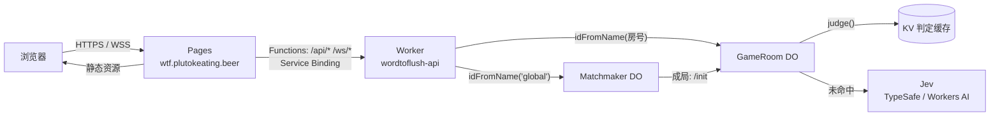

# 架构



## 模块边界

| 模块 | 位置 | 职责 |
|---|---|---|
| 前端 | `apps/web/src` | 纯展示与输入；不持有答案、不驱动计时 |
| 反代 | `apps/web/functions` | 同源转发，隐藏 Worker 域名，免 CORS |
| 路由 | `apps/worker/src/index.ts` | 来源白名单、uid/昵称规范化、分发到 DO |
| 房间 | `apps/worker/src/room.ts` | 权威游戏状态、计分、字位揭示、alarm 计时、广播 |
| 匹配 | `apps/worker/src/matchmaker.ts` | 排队、成局、分配房号 |
| 判定 | `apps/worker/src/judge.ts` | Jev 调用、通道切换、KV 缓存；可整体替换 |
| 共享 | `packages/shared` | 规则常量、清洗函数、协议类型，前后端同源 |

## 关键设计

- **谜底不出 DO**：`RoomView` 在 `reveal` / `finished` 之前不含答案，字位只下发已点亮的字。
- **服务端计时**：回合超时、揭晓 3 秒后进下一题、匹配房等人超时，全部由 DO `alarm()` 驱动；前端用 `deadline` 与 `now` 校正时钟后展示倒计时。
- **Hibernation**：DO 使用 `ctx.acceptWebSocket`，空闲时不常驻；状态持久化在 `ctx.storage`（SQLite 后端）。alarm 触发时无人在线则清空房间。
- **判定**：一次 Jev 请求携带两个问题——`score`（10 级量表，加权均值 / 9 → 关联度）与 `noul`（是否同一事物，≥ 0.9 判猜中）；字面相等直接猜中不调用。结果按 `(谜底 id, 猜测词)` 缓存，保证同词同分。
- **并发**：`judge()` 期间 DO 可能处理其他消息，返回后重新校验阶段与题目 id，避免旧结果写入新题。

## 游戏流程

```
lobby ──start / 满员 / 匹配超时──▶ playing ──猜中 / 超时 / 跳过──▶ reveal(3s) ──▶ playing …
                                                                  └─ 第 5 题后 ─▶ finished ──restart──▶ playing
```

| 模式 | 人数 | 开局 | 换题/放弃 |
|---|---|---|---|
| solo | 1 | 进入即开局 | 自己 |
| private | ≤ 8 | 房主点击 | 房主 |
| match | 2–4 | 全员到齐或 15 秒 | 首位入房者 |

计分：猜中者 +100；其余玩家 + ⌊本题最高关联度% / 10⌋。
